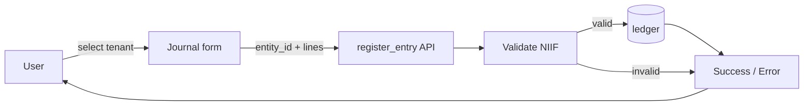
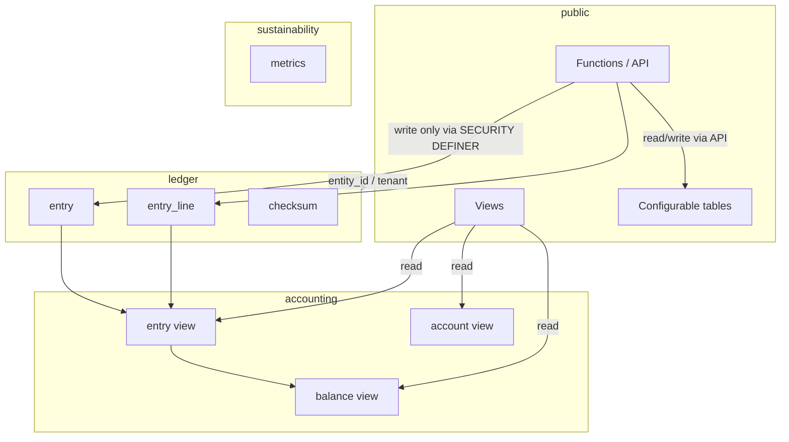
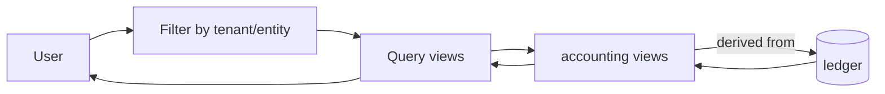

# Arquitectura

Diagramas de flujo y esquema de schemas de Prodaric Accounting (multi-tenant). Referencia: design.md y plan.md en la raíz del repositorio.

El alcance de pantallas documentado en [Wireframes](wireframes.md) incluye, además del journal y la consulta del diario/saldos/reportes, las pantallas ampliadas: dashboard, detalle de asiento, balance de comprobación (trial balance), cierre de período, administración de entidad y período, reversión de asiento (nuevo asiento de reversa vía API, sin borrar el original) y consulta de audit log. Los flujos de escritura (registro de asiento, reversión, cierre) pasan por funciones en `public` hacia `ledger` o tablas de configuración; las consultas y reportes usan las vistas derivadas de `accounting`.

## Flujo de registro de asiento (multi-tenant)

El usuario selecciona tenant/entidad, completa el formulario journal y la API llama a `register_entry` con tenant/entity_id. Tras validación NIIF se escribe en ledger (entry + entry_line + checksum); la respuesta es éxito o error.

## Esquema de schemas

Nodos: public, ledger, accounting, sustainability. El modelo incluye tenant/entity_id donde corresponde. Solo lectura desde public hacia accounting/ledger; escritura solo vía función hacia ledger.

## Flujo de lectura

El usuario filtra por tenant/entidad; la aplicación consulta vistas (entry, balance, account); las vistas en accounting están derivadas de ledger. No hay escritura en este flujo.

