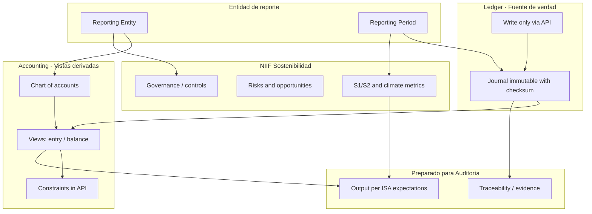

# Diseño del proyecto: Prodaric Accounting

**Producto:** Prodaric Accounting  
**Posicionamiento:** Contabilidad, Sostenibilidad y Auditoría

Documento de diseño del sistema de contabilidad en PostgreSQL alineado a estándares internacionales IFRS/NIIF (contabilidad y sostenibilidad) y preparado para generar información auditable según estándares de auditoría IAASB (ISA).

### Propósito, uso e implementación

- **Propósito:** Sistema de administración contable para entidades de reporte (multi-tenant), con libro diario inmutable en el schema `ledger`, estados y reportes derivados en `accounting`, y soporte a sostenibilidad (IFRS S1/S2) y auditoría (ISA).
- **Uso:** La aplicación se conecta como usuario `prodaric` (solo schema `public`): lee datos mediante vistas en `public` y escribe únicamente ejecutando funciones en `public`; no ejecuta INSERT/UPDATE/DELETE directos sobre `ledger`, `accounting` ni `sustainability`.
- **Implementación:** Schemas y flujo de datos en §2.5 y §2.7; lista detallada de funciones y vistas (contrato API) en [plan.md](plan.md) §3.

---

## 1. Contexto de estándares (última versión considerada)

### 1.1 IFRS/NIIF Contabilidad

- **Marco Conceptual para la Información Financiera (2018)**, vigente y base de las NIIF: define objetivo de la información financiera, características cualitativas, **elementos** (activo, pasivo, patrimonio, ingresos, gastos), **reconocimiento**, **medición** y **presentación**.
- **IAS 1 (Presentación de Estados Financieros)**: prohíbe la **compensación** (offsetting) de activos y pasivos, e ingresos y gastos, salvo cuando una NIIF lo permita o requiera expresamente.
- **IFRS Accounting Taxonomy 2024**: taxonomía XBRL que refleja NIIF a 1 ene 2024; útil como referencia de elementos y estructura de presentación, no como sustitución del modelo transaccional.
- La contabilidad bajo NIIF descansa en **partida doble** y en la igualdad: Activos − Pasivos = Patrimonio; los cambios en patrimonio (salvo aportes y distribuciones) se explican por Ingresos − Gastos.

### 1.2 IFRS/NIIF Sostenibilidad (ISSB)

- **IFRS S1** (efectivo 1 ene 2024): requisitos generales de revelación de información financiera relacionada con sostenibilidad (gobernanza, estrategia, gestión de riesgos y oportunidades, métricas y metas).
- **IFRS S2**: revelaciones climáticas (Scope 1, 2, 3; riesgos físicos y de transición; oportunidades).
- Ambos están pensados para la **misma entidad de reporte** que los estados financieros y pueden integrarse en el mismo informe (p. ej. informe integrado).
- En desarrollo: estándares sobre biodiversidad/ecosistemas (BEES) y capital humano.

### 1.3 Auditoría (estándar que compete al programa)

- **IAASB** (International Auditing and Assurance Standards Board), bajo IFAC: emisor de los estándares internacionales de auditoría y aseguramiento.
- **ISA** (Normas Internacionales de Auditoría): aplicables a la auditoría de estados financieros; definen evidencia, formación de opinión e informe (ej. ISA 700, 260, 315, 330). En muchos países se adoptan o se usan como base de las normas locales.
- **ISAE, ISRE, ISQM, ISQC**: otros pronunciamientos del IAASB (aseguramiento distinto de auditoría, revisión, gestión de calidad y control de calidad en firmas).

Para Prodaric Accounting, el estándar que **compete directamente** al programa es el de **auditoría (IAASB – ISA)**: el sistema producirá estados financieros y revelaciones que serán objeto de auditoría; el diseño debe favorecer trazabilidad, integridad de datos y controles que faciliten el trabajo del auditor según ISA.

---

## 2. Decisiones de diseño

### 2.1 Conclusión de viabilidad

La propuesta es **viable, loable y posible**, con alcance bien delimitado:

- **Viable**: PostgreSQL permite modelar entidad de reporte, plan de cuentas por elemento NIIF, transacciones en partida doble, períodos, y restricciones de integridad que reflejen reglas contables y de presentación que son **deterministas**.
- **Loable**: Alinear el modelo de datos al Marco Conceptual y a restricciones explícitas (partida doble, no compensación en presentación, clasificación por elementos) mejora la calidad y la trazabilidad de la información.
- **Posible**: La compatibilidad entre NIIF contabilidad y NIIF sostenibilidad está prevista por el propio diseño (misma entidad, mismo período, informe integrado); el modelo puede soportar ambas fuentes de datos (contables y de sostenibilidad) con una entidad de reporte común.

### 2.2 Qué SÍ se implementa como restricciones/lógica en el modelo (PostgreSQL)

| Área                                  | Implementación práctica                                                                                                                                                                                                                   |
| ------------------------------------- | ----------------------------------------------------------------------------------------------------------------------------------------------------------------------------------------------------------------------------------------- |
| **Partida doble**                     | Por cada transacción (o lote de asientos): suma de débitos = suma de créditos. CHECK o trigger a nivel de transacción/líneas.                                                                                                             |
| **Clasificación de cuentas**          | Plan de cuentas con elemento (activo, pasivo, patrimonio, ingreso, gasto) y tipo normal (débito/crédito). Restricciones para que los movimientos respeten la naturaleza de la cuenta.                                                     |
| **Ecuación contable**                 | Activos − Pasivos = Patrimonio al cierre; validación por período/entidad (vistas materializadas, funciones, o procesos de cierre).                                                                                                        |
| **No compensación en almacenamiento** | Registro por cuenta y partida (no neteo en una sola línea activo-pasivo). La **presentación** sin compensación (IAS 1.32) se garantiza en reportes/agregaciones, no mezclando cuentas de activo con cuentas de pasivo en una misma línea. |
| **Entidad de reporte y período**      | Tablas de entidad (single, consolidada, combinada según Marco Conceptual 3.10–3.18), períodos de reporte y estado (abierto/cerrado) para evitar cambios en períodos cerrados.                                                             |
| **Moneda y tipo de cambio**           | Moneda funcional y de presentación; soporte para conversión según IAS 21.                                                                                                                                                                 |
| **Trazabilidad**                      | Transacciones inmutables (append-only o con historial) para auditoría y verificación; alineado con expectativas de evidencia bajo ISA.                                                                                                    |

Esto prioriza NIIF contabilidad en el núcleo del modelo (partida doble, elementos, ecuación contable), deja la puerta abierta a sostenibilidad en las mismas entidades y períodos, y refuerza la **auditoría** mediante datos trazables y restricciones que facilitan el encargo según ISA.

### 2.3 Qué NO se reduce solo a restricciones de BD

- **Reconocimiento** (Marco Conceptual cap. 5): Criterios de "información útil" (relevancia y representación fiel) y restricción de costo implican **juicio**. No existe un algoritmo único en BD que decida si un ítem debe reconocerse; el sistema puede almacenar ítems reconocidos y no reconocidos (con notas) y aplicar políticas configuradas, pero la decisión última es profesional.
- **Medición** (Marco Conceptual cap. 6): Costo histórico vs valor actual (fair value, etc.) depende del estándar (IFRS 9, 13, 16, etc.) y de juicio. El modelo puede almacenar **bases de medición** y **valores** por ítem; las reglas de qué base aplicar por tipo de activo/pasivo son lógica de aplicación o configuración, no solo CHECK en tabla.
- **Materialidad** (Marco Conceptual 2.11): Es "entity-specific"; no hay umbral numérico universal. Puede modelarse umbrales por entidad/cuenta como apoyo, pero no como sustitución del juicio.
- **Unidad de cuenta y sustancia sobre forma** (Marco Conceptual 4.48–4.62): Agrupar o separar derechos/obligaciones es criterio de representación fiel; el modelo puede soportar unidades de cuenta (por contrato, portfolio, etc.) pero no imponer la decisión solo con constraints.

Por tanto: el modelo en PostgreSQL debe **soportar** los datos que alimentan estas decisiones (reconocimiento, medición, presentación) y puede **aplicar** políticas configuradas (por tipo de cuenta, estándar, entidad), pero las restricciones "duras" que se pueden codificar son las de partida doble, clasificación, ecuación contable, no compensación en registro/presentación y control de períodos/entidad.

### 2.4 Compatibilidad NIIF Contabilidad y NIIF Sostenibilidad

- **Misma entidad de reporte**: Tanto los estados financieros como las revelaciones IFRS S1/S2 se refieren a la misma entidad (individual, consolidada o combinada). El modelo debe tener una noción única de **entidad de reporte** y asociar a ella:
  - Datos contables (cuentas, transacciones, saldos).
  - Datos de sostenibilidad (gobernanza, estrategia, riesgos/oportunidades, métricas climáticas, etc.).
- **Mismo período**: Períodos de reporte alineados para que los reportes financieros y de sostenibilidad sean comparables en el tiempo.
- **Estructura de datos de sostenibilidad**: IFRS S1/S2 son sobre todo **revelaciones** (narrativa + métricas). El modelo puede incluir:
  - Tablas o estructuras para métricas (emisiones Scope 1/2/3, objetivos, avances).
  - Catálogos de riesgos/oportunidades, gobernanza y procesos.
  - Relación N:1 con entidad de reporte y período.

No hay conflicto normativo entre "priorizar NIIF" contabilidad y "adaptar para compatibilidad" con sostenibilidad: el Marco Conceptual y el ISSB comparten usuario principal (inversores y acreedores) y la misma entidad; la integración en un único sistema de datos es coherente con los estándares.

### 2.5 Estructura de la base de datos: schemas (decisión adoptada)

- **Decisión:** Organizar el modelo en **schemas de PostgreSQL** (no usar `public` para todo con prefijos de "dominio" en nombres de tablas, p. ej. `acc_accounts`).
- **Ventaja:** Nombres de tablas y vistas limpios por contexto, en **singular** y en inglés: p. ej. `accounting.account`, `accounting.entry`, `accounting.balance`, `sustainability.metric`, en lugar de prefijos en `public`. Todos los nombres de tablas, vistas, funciones y demás objetos de BD siguen las convenciones de [.cursor/rules/data-model.mdc](.cursor/rules/data-model.mdc): inglés, minúsculas, singular; FKs como `tabla_id`; COMMENT en español cuando haga falta para explicar.
- **Propuesta de esquemas:**
  - **`ledger`**: **Única fuente de verdad para el journal (libro diario)**. Tablas inmutables (p. ej. `entry`, `entry_line`) con checksum (SHA-256 o SHA-1) que almacenan asientos y líneas ya comprometidos. Solo se escribe mediante funciones que aplican estrictamente las reglas y directrices de los estándares (NIIF, ISA); no pueden crearse asientos fuera de esas reglas. Restringido a sysadmin para escritura directa; la aplicación solo inserta vía API (funciones en public).
  - **`accounting`**: **Solo vistas derivadas** (y catálogos de solo lectura si se desea) sobre `ledger` y datos de referencia: vistas en singular como `entry`, `balance` (saldos por account/period), `account` (plan de cuentas), `entity`, `period`, `currency`; además `statement_financial_position` y `statement_result` agregan por elemento (activo/pasivo/patrimonio e ingreso/gasto) para reportes que aplican **no compensación (IAS 1.32)** en presentación. No hay tablas de hechos contables en accounting; todo el funcionamiento lógico es estrictamente compatible con los estándares porque la única escritura contable ocurre en `ledger` a través de la API controlada.
  - **`sustainability`**: gobernanza, riesgos/oportunidades, métricas IFRS S1/S2 (p. ej. climáticas), objetivos. Referencias a entidad y período. **Restringido a sysadmin** para escritura directa; la aplicación accede vía funciones/vistas en public.
  - Opcional **`core`** o **`common`**: si se desea separar entidad de reporte y período en un esquema compartido al que apunten las vistas en `accounting` y `sustainability`; si no, entidad y período viven en tablas de referencia a las que solo sysadmin escribe y las vistas leen.
- **`public`**: **Funciones, vistas, secuencias, procedimientos** (API de entrada/salida) y **tablas o parámetros configurables** (los que puedan ser configurados por la entidad o el usuario: p. ej. preferencias de presentación, parámetros de reporte, configuración de moneda de presentación). La aplicación se conecta con un usuario que tiene privilegios sobre `public`; ejecuta funciones, consulta vistas y, donde corresponda, lee/escribe solo en tablas configurables de public. No puede alterar `ledger`, `accounting` ni `sustainability` con queries estándar.
- En el diseño detallado, definir exactamente qué tablas/vistas van en cada schema, qué es configurable en public, y las FK o dependencias entre schemas.

### 2.6 Datos iniciales y plan de cuentas (decisión adoptada)

- **Datos iniciales:** Sí ofrecer datos iniciales como decisión de producto (no exigido por NIIF). Incluir, entre otros: monedas, tipos de documento y un **plan de cuentas de arranque**.
- **Plan general contable:** Incluir un plan de cuentas **plantilla/inicial** que cumpla NIIF: alineado a los 5 elementos del Marco Conceptual y con detalle suficiente para presentar los ítems mínimos de IAS 1. No es un plan legal obligatorio (IFRS no prescribe un plan único); es una ayuda para que la entidad arranque.
- **Estructura del plan:** Plan **simple desde las 5 cuentas principales** (Activos, Pasivos, Patrimonio, Ingresos, Gastos) y **extensible**: el usuario puede crear subcuentas y cuentas adicionales bajo cada elemento. Cada cuenta con elemento y naturaleza débito/crédito para partida doble y restricciones en BD.
- **Universal vs por industria:** Arrancar con **un solo plan base IFRS general** (las 5 cuentas + nivel mínimo para IAS 1). Plantillas por industria (retail, manufactura, etc.) quedan como **opción posterior** si aportan valor; no son obligatorias en v1.
- **Ventaja:** Alineado al Marco Conceptual, válido para cualquier sector, mantenimiento simple y máxima flexibilidad para que cada entidad adapte el detalle.

### 2.7 Inmutabilidad, verificación y control de acceso (decisión adoptada)

Una contabilidad correcta exige **datos inmutables y verificables**. El diseño incorpora un schema aislado para esos datos, checksums de integridad y un modelo de ejecución basado en funciones (sin queries estándar públicos sobre tablas de negocio).

**Journal en ledger como única fuente de verdad; accounting como vistas derivadas**

- **Ledger = journal inmutable:** El **journal (libro diario)** vive únicamente en el schema **`ledger`**. Ahí se almacenan los asientos y sus líneas (débito/crédito) con checksum (SHA-256 preferible, o SHA-1 donde sea suficiente). No pueden crearse asientos fuera de las reglas y directrices de los estándares (NIIF, IAS 1, ISA): toda escritura en `ledger` ocurre mediante **funciones** que validan partida doble, elementos, período abierto, etc., y solo entonces insertan en las tablas inmutables. El funcionamiento lógico es así estrictamente compatible con los estándares.
- **Accounting = vistas derivadas:** El schema **`accounting`** no contiene tablas de hechos de transacciones; contiene **vistas** en singular (p. ej. `entry`, `balance`, `account`, `entity`, `period`, `currency`) derivadas de `ledger` y de tablas de referencia. Cualquier consulta "contable" que haga la aplicación va contra vistas en public que lean de `accounting` o de `ledger` según corresponda; nadie escribe en accounting porque no hay tablas de escritura allí.
- **Checksums:** Cada registro o lote en `ledger` almacena un hash que permite verificar que no ha sido alterado. Solo las funciones/triggers autorizados (y sysadmin) pueden escribir en `ledger`.

**Base de datos y roles PostgreSQL (credenciales)**

- **Base de datos:** `prodaric_accounting`.
- **Usuario aplicación:** `prodaric`. Solo tiene acceso al schema **`public`**: puede conectarse a la base `prodaric_accounting`, ejecutar funciones en public, leer vistas y tablas configurables en public, usar secuencias expuestas. **No** tiene privilegios sobre `ledger`, `accounting` ni `sustainability`; no puede alterar la contabilidad con queries estándar.
- **Usuario superior (sysadmin):** `prodaric_sys`. Acceso total al modelo: propietario (o con privilegios completos) de los schemas `ledger`, `accounting` y `sustainability`; puede crear/alterar objetos, gestionar triggers, y en caso necesario modificar o corregir datos. Las migraciones y el mantenimiento de la BD se ejecutan con este usuario; la aplicación en runtime se conecta con `prodaric`.

La definición concreta de roles y GRANTs se encuentra en [sql/01_roles.sql](sql/01_roles.sql).

**Modelo de ejecución: funciones como algoritmo entrada/salida**

- **Sin queries estándar públicos sobre datos:** La aplicación **no** ejecuta `INSERT`/`UPDATE`/`DELETE` directos sobre tablas de contabilidad o ledger. Toda interacción con los datos se hace mediante **funciones, triggers, secuencias y procedimientos** definidos en `public` (o en schemas de negocio pero invocados desde public con `SECURITY DEFINER`).
- **Flujo:** La aplicación llama a una función (p. ej. `public.register_entry(...)`). Esa función valida la entrada con las reglas NIIF (partida doble, elementos, período, etc.); si es válida, escribe **solo en `ledger`** (con checksum) mediante SECURITY DEFINER. No hay tablas de staging intermedias para el journal: la única escritura contable es en `ledger`. La función devuelve una respuesta (éxito, error, identificador). **Ejecutar función → recibir respuesta**. Las consultas de la aplicación usan vistas en public que leen de `accounting` (vistas derivadas de `ledger`) o de `ledger` según se defina.
- **Objetivo:** Imposibilitar asientos fuera de los estándares; toda la lógica de escritura contable esté en funciones que solo insertan en `ledger` cumpliendo las reglas. El sistema funciona como **algoritmos de entrada y salida**: ejecutar función → recibir respuesta.
- **Contrato con la capa de aplicación:** La API (en este repo o externa) solo escribe mediante las funciones en `public` y lee mediante las vistas en `public`; no hay escritura directa sobre ledger/accounting/sustainability. Resumen del contrato (funciones y vistas a usar): [plan.md](plan.md) §3.

**Configuración en public**

- **Parámetros o tablas configurables en public:** Los datos que la entidad o el usuario puedan configurar (moneda de presentación, preferencias de reporte, tipos de documento permitidos, etc.) viven en **`public`**: tablas o vistas que el usuario de la aplicación puede leer y, donde corresponda, actualizar mediante funciones de configuración. Así se evita mezclar configuración con datos inmutables y se mantiene la API clara.

**Resumen**

- **Base de datos:** `prodaric_accounting`. **Usuario app:** `prodaric` (solo `public`). **Usuario sysadmin:** `prodaric_sys` (acceso total a ledger, accounting, sustainability).
- **`public`:** Funciones, vistas, secuencias, procedimientos (API) y tablas configurables. Accesible por `prodaric`. No permite alterar `ledger` ni las tablas de referencia en otros schemas.
- **`ledger`:** Única fuente de verdad del journal; tablas inmutables con checksum. Solo escritura vía funciones (SECURITY DEFINER); acceso directo solo para `prodaric_sys`.
- **`accounting`:** Solo vistas derivadas (y catálogos de solo lectura si aplica) sobre `ledger` y referencia; sin tablas de hechos de escritura; objeto de schemas propiedad de `prodaric_sys`.
- **`sustainability`:** Tablas de datos; acceso completo para `prodaric_sys`; la aplicación accede vía funciones/vistas en public.

### 2.8 Autenticación, autorización y control de acceso (ACL)

**IdP externo**

La aplicación no gestiona contraseñas; se usa un Identity Provider externo (OAuth2 / OpenID Connect). La API valida el token (JWT), extrae `sub` (identificador de usuario) y el tenant/entidad; la autorización se resuelve por roles y permisos en el backend.

**Recursos (en inglés, singular)**

Todos los recursos están acotados por tenant (`entity_id`): entity, period, chart_of_accounts, journal, ledger, balance, report, configuration, sustainability, user.

**Permisos (formato recurso:acción)**

| Permiso | Descripción |
|---------|-------------|
| entity:read | Ver entidades a las que tiene acceso |
| entity:manage | Alta/edición de entidades (admin) |
| period:read | Ver períodos |
| period:manage | Crear/cerrar períodos |
| chart_of_accounts:read | Ver plan de cuentas |
| chart_of_accounts:write | Crear/extender cuentas |
| journal:write | Registrar asientos (ejecutar register_entry) |
| ledger:read | Consultar libro diario |
| balance:read | Consultar saldos / mayor |
| report:read | Ver y exportar estados financieros |
| configuration:read | Ver configuración |
| configuration:write | Modificar configuración |
| sustainability:read | Consultar métricas S1/S2 |
| sustainability:write | Cargar/editar métricas S1/S2 |
| user:read | Ver usuarios del tenant |
| user:manage | Alta/baja de usuarios y asignación de roles en el tenant |

**Roles RBAC por tenant**

Cada rol se asigna por tenant (un usuario puede tener distintos roles en distintas entidades).

| Rol | Permisos |
|-----|----------|
| admin | Todos los permisos anteriores |
| accountant | entity:read, period:read, chart_of_accounts:read, chart_of_accounts:write, journal:write, ledger:read, balance:read, report:read, configuration:read, sustainability:read, sustainability:write |
| auditor | entity:read, period:read, chart_of_accounts:read, ledger:read, balance:read, report:read, configuration:read, sustainability:read (solo lectura) |
| viewer | entity:read, period:read, chart_of_accounts:read, balance:read, report:read (lectura limitada; sin ledger:read si se desea ocultar el diario) |

**Modelo de datos**

En **desarrollo**, las tablas de identidad y RBAC viven en el schema **`angelauth`** (identity, role, permission, role_permission, user_role); los scripts están en el directorio `angelauth/` (no versionado). La aplicación contable resuelve identidad y permisos con SELECT sobre `angelauth.*`. En **producción**, la autorización puede resolverse por claims del IdP (rol, tenant) sin depender de esas tablas; si se mantiene un espejo de roles en BD, puede vivir en el IdP o en un servicio derivado de angelauth. La tabla **audit_log** permanece en schema `public`, con `identity_id` referenciando `angelauth.identity(id)` cuando se use el modelo local; nombres según [.cursor/rules/data-model.mdc](.cursor/rules/data-model.mdc). Trazabilidad ISA y OWASP.

**Flujo**

Petición → validar JWT → extraer sub y tenant → comprobar permiso para la acción/recurso en ese tenant → ejecutar función o vista; registrar en audit_log las operaciones sensibles (journal:write, configuration:write, user:manage).

**Cumplimiento**

Referencia a OWASP ASVS (V2 autenticación, V3 sesión, V4 control de acceso) y a ISA (evidencia mediante audit log). El usuario de BD con el que corre la aplicación sigue siendo `prodaric`; la autorización es a nivel de aplicación (API), no de rol PostgreSQL por sesión.

---

## 3. Diagrama de alto nivel (alcance del modelo)

---

## 4. Riesgos y mitigaciones

| Riesgo                                                               | Mitigación                                                                                                                                                                             |
| -------------------------------------------------------------------- | -------------------------------------------------------------------------------------------------------------------------------------------------------------------------------------- |
| Interpretar que "todas" las reglas NIIF pueden ser constraints en BD | Documentar claramente qué reglas son deterministas (partida doble, no compensación en presentación, clasificación) y cuáles requieren juicio (reconocimiento, medición, materialidad). |
| Cambios futuros en NIIF o ISSB                                       | Diseñar plan de cuentas y catálogos (elementos, bases de medición, tipos de revelación) con versionado y fechas de vigencia; evitar hardcodear estándares concretos en el esquema.     |
| Sostenibilidad muy narrativa                                         | Modelar métricas y referencias a documentos o textos; no intentar capturar toda la narrativa en tablas normalizadas.                                                                   |

---

## 5. Próximos pasos de implementación

1. **Definir alcance funcional v1**: solo contabilidad (libro mayor, balances, reportes básicos) o también módulo de sostenibilidad (métricas S1/S2).
2. **Datos iniciales y plan de cuentas**: incluir seed data (monedas, tipos de documento) y plan de cuentas base de 5 elementos (Activos, Pasivos, Patrimonio, Ingresos, Gastos) extensible; suficiente detalle para ítems mínimos IAS 1.
3. **Diseñar esquema PostgreSQL**: entidad de reporte, períodos, plan de cuentas (con elemento NIIF y tipo débito/crédito), transacciones y líneas (débito/crédito por cuenta), triggers/CHECK para partida doble y ecuación contable.
4. **Reglas de presentación**: vistas o capa de reportes que apliquen "no compensación" (IAS 1.32) al presentar activos/pasivos e ingresos/gastos.
5. **Consultar .cursor/rules**: cuando existan reglas de desarrollo en `.cursor/rules/`, alinear nombres, convenciones y calidad de código con ellas.
6. **Considerar requisitos ISA**: en el diseño de reportes y trazabilidad (evidencia, inmutabilidad, controles) para que la salida de Prodaric Accounting facilite encargos de auditoría según IAASB.
7. **Implementar modelo de acceso y inmutabilidad**: roles app vs sysadmin; schema `ledger` con registros verificables (checksum SHA-256/SHA-1); API en `public` (funciones/vistas); funciones SECURITY DEFINER que escriban solo en `ledger`; sin escritura directa desde la aplicación sobre tablas de negocio (en `accounting` no hay tablas de escritura, solo vistas derivadas).

---

## 6. Referencias utilizadas

- IFRS Foundation, *Conceptual Framework for Financial Reporting* (2024 issued).
- IAS 1 *Presentation of Financial Statements* (offsetting, párr. 32).
- IFRS S1 *General Requirements for Disclosure of Sustainability-related Financial Information*; IFRS S2 *Climate-related Disclosures*.
- IFRS Foundation, IFRS Accounting Taxonomy 2024; ISSB updates (2025–2026).
- IAASB (IFAC): Manual de Pronunciamientos (ISA, ISAE, ISRE, ISQM, ISQC) – estándares de auditoría y aseguramiento.
- Documentación y buenas prácticas para partida doble en bases de datos (constraints por transacción, diseño dos filas por asiento).
